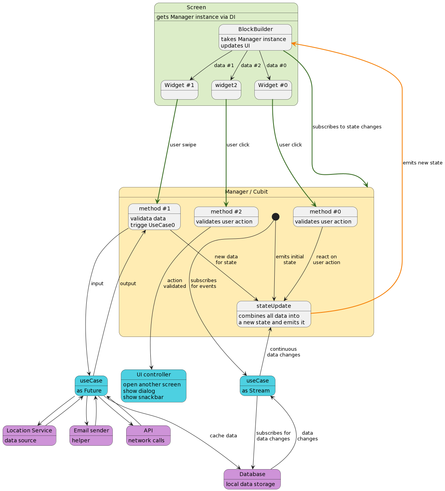

# Data flow in the application

This doc describes the relationships between different pars of the application and how the data flow
works there.

### Screen <-> Manager

* every `screen` suppose to have its own `manager` (gets via `DI`)
* `screen` subscribes for the `manager` state changes
* all user interactions (actions) are delivered to the `manager`
* `manager` takes care on the user action and react on them (in case of need)
* in case of need, `manager` can:
    * trigger `useCase` to fetch some data
    * subscribe for the `useCase` events (continuous stream events)
    * trigger UI changes
        - open another screen
        - show dialog/snackbar
    * emit updated state back to the `screen`
    * track events (crashlytics/analytics)

### Manager <-> UseCases / UIControllers / Tools

* every `managers` operates with the `UseCases`
* `useCases` are injected into manager via constructor (with help of `DI`)
* all user interactions are validated inside the `manager`
* `manager` responsible for UI changes
    - opening another screen
    - showing dialog
    - showing snackbar
    - emitting state with new data for current screen
* user interactions can be tracked inside the `manager` (clicks, etc)

### UseCases <-> Data source / helpers

* `useCases` are small, atomic operations
* can be simple (`future`) operation like `get`/`set` or continuous data watcher (`stream`)  
* they can interact with the
    * different `sources of data`:
        - network API
        - local storage
        - device sensors (connectivity, gps, bluetooth, etc)
        - etc
    * different type of `helpers`:
        - mappers (convert `json dto` -> `entity` <-> `data model`)
        - data filters and sorters
        - crashlytics (to track failed API calls, etc)
        - audio player/share/screenshot/email sender/etc `helpers`
        - etc
    * other `useCases`
* all those instances are injected via the `useCase` constructor (with help of `DI`)

## Diagram

 Manager relationships"/>

    
plantuml diagram script

    @startuml
    state Screen #dcedc8 {
    state BlockBuilder
    BlockBuilder: takes Manager instance
    BlockBuilder: updates UI
    state "Widget #0" as widget0
    state "Widget #1" as widget1
    
    BlockBuilder --> widget0: data #0
    BlockBuilder --> widget1: data #1
    BlockBuilder --> widget2: data #2
    }
    Screen: gets Manager instance via DI
    
    
    state "Manager / Cubit" as Manager #ffecb3{
    state stateUpdate
    stateUpdate: combines all data into
    stateUpdate: a new state and emits it
    
    state "method #0" as method0
    method0: validates user action
    
    state "method #1" as method1
    method1: validata data
    method1: trigge UseCase0
    
    state "method #2" as method2
    method2: validates user action
    
    [*] --down-> useCase1: subscribes\nfor events
    [*] ---> stateUpdate: emits initial\nstate
    method0 ---> stateUpdate: react on\nuser action
    method1 ----> useCase0: input
    useCase0 ----> method1: output
    useCase1 -up-> stateUpdate: continuous\ndata changes
    method1 ---> stateUpdate: new data\nfor state
    method2 ----> uiController: action\nvalidated
    }
    
    state "useCase" as useCase1 #4dd0e1{
    }
    useCase1: as Stream
    useCase1 ---> db: subscribes for\ndata changes
    db ---> useCase1: data\nchanges
    
    state "useCase" as useCase0 #4dd0e1{
    }
    useCase0: as Future
    useCase0 --> api
    api --> useCase0
    useCase0 --> gps
    gps --> useCase0
    useCase0 --> email
    email --> useCase0
    useCase0 --> db: cache data
    
    state "UI controller" as uiController #4dd0e1 {
    }
    uiController: open another screen
    uiController: show dialog
    uiController: show snackbar
    
    state "API" as api #ce93d8{
    }
    api: network calls
    
    state "Database" as db #ce93d8{
    }
    db: local data storage
    
    state "Location Service" as gps #ce93d8{
    }
    gps: data source
    
    state "Email sender" as email #ce93d8{
    }
    email: helper
    
    
    BlockBuilder --[#33691e,bold]--> Manager: subscribes to state changes
    widget0 --[#33691e,bold]--> method0: user click
    widget1 --[#33691e,bold]--> method1: user swipe
    widget2 --[#33691e,bold]--> method2: user click
    stateUpdate --[#f57c00,bold]--> BlockBuilder: emits new state
    @enduml

----------------

[Need to edit diagram?](edit_plantuml_diagrams.md)