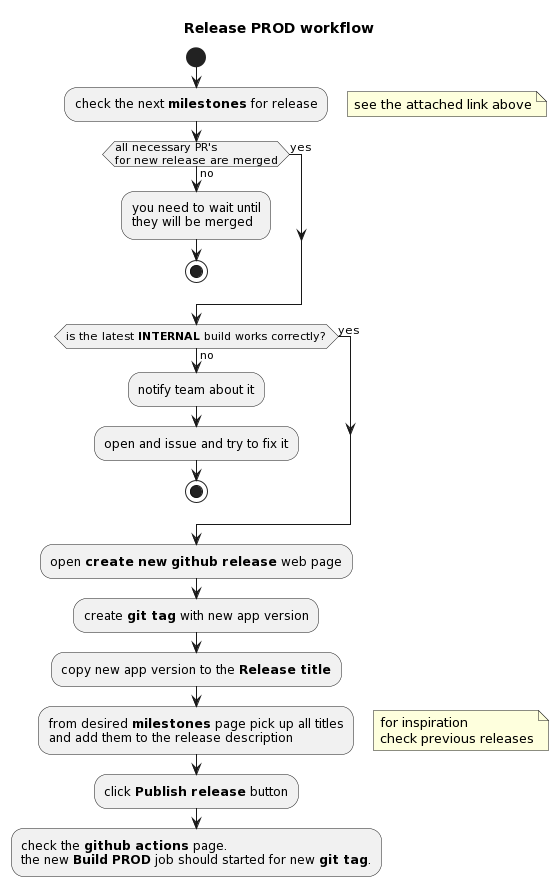

## Release workflow

This doc contains main moments of the release workflow and some 'howTO'.

Some references from this doc:

1. [Stagings](./STAGINGS.md)
2. [Milestones](https://github.com/kazky-dytynstva/mobile-app/milestones)
3. [Create new github release](https://github.com/kazky-dytynstva/mobile-app/releases/new)
4. [Delete git tag](https://github.com/kazky-dytynstva/mobile-app/tags)
5. [Build PROD actions](https://github.com/kazky-dytynstva/mobile-app/actions/workflows/build_prod.yaml)

## Prod release

    
plantuml diagram script

    @startuml
    title: Release PROD workflow
      start
      :check the next **milestones** for release;
        floating note right: see the attached link above
      if (all necessary PR's\nfor new release are merged) then (no)
        :you need to wait until\nthey will be merged;
        stop;
      else (yes) 
      endif
      if (is the latest **INTERNAL** build works correctly?) then (no)
        :notify team about it;
        :open and issue and try to fix it;
        stop;
      else (yes) 
      endif
      :open **create new github release** web page;
      :create **git tag** with new app version;
      :copy new app version to the **Release title**;
      :from desired **milestones** page pick up all titles\nand add them to the release description;
        floating note right: for inspiration\ncheck previous releases
      :click **Publish release** button;
      :check the **github actions** page.\nthe new **Build PROD** job should started for new **git tag**.;
    @enduml

--------

[Need to edit diagram?](edit_plantuml_diagrams.md)