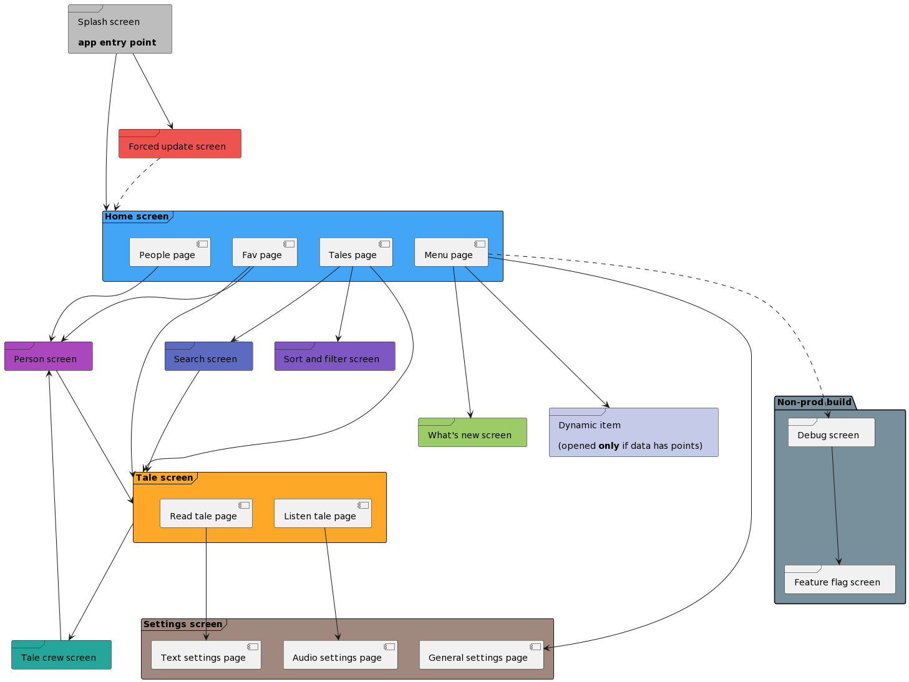

# Screens schema

This doc describes the relationships between all screens (and some pages) that we are using in this app.

## Schema

    
plantuml diagram script

    @startuml
    frame "Splash screen\n\n<b>app entry point</b>" as screenSplash #bdbdbd
    
    frame "Home screen" as screenHome #42a5f5 {
    [Tales page] as pageHomeTales
    [Fav page] as pageHomeFav
    [People page] as pageHomePeople
    [Menu page] as pageHomeMenu
    }
    
    frame "Settings screen" as screenSettings #a1887f{
    [General settings page] as pageSettingsGeneral
    [Audio settings page] as pageSettingsAudio
    [Text settings page] as pageSettingsText
    }
    frame "Sort and filter screen" as screenSortAndFilter #7e57c2
    frame "Search screen" as screenSearch #5c6bc0
    frame "Person screen" as screenPerson #ab47bc
    frame "Tale crew screen" as screenTaleCrew #26a69a
    frame "What's new screen" as screenWhatsNew #9ccc65
    frame "Dynamic item\n\n(opened <b>only</b> if data has points)" as screenDynamicItem #c5cae9
    frame "Forced update screen" as screenForcedUpdate #ef5350
    
    package "Non-prod build" #78909c{
    frame "Debug screen" as screenDebug
    frame "Feature flag screen" as screenFeatureFlag
    }
    
    frame "Tale screen" as screenTale #ffa726 {
    [Read tale page] as pageTaleRead
    [Listen tale page] as pageTaleListen
    }
    
    screenSplash --down--> screenHome
    screenSplash ---> screenForcedUpdate
    
    screenForcedUpdate ..down.> screenHome
    
    pageHomeTales --down-> screenTale
    pageHomeTales ---> screenSortAndFilter
    pageHomeTales --down-> screenSearch
    pageHomeFav ---> screenTale
    pageHomeFav ---> screenPerson
    pageHomePeople ---> screenPerson
    pageHomeMenu ----> pageSettingsGeneral
    pageHomeMenu -..-> screenDebug
    pageHomeMenu ----> screenWhatsNew
    pageHomeMenu ----> screenDynamicItem
    
    screenPerson --down-> screenTale
    
    screenSearch ---> screenTale
    
    screenTale ---> screenTaleCrew
    pageTaleRead ---> pageSettingsText
    pageTaleListen ---> pageSettingsAudio
    
    screenTaleCrew --up-> screenPerson
    
    screenDebug -down--> screenFeatureFlag
    @enduml

----------------

[Need to edit diagram?](edit_plantuml_diagrams.md)