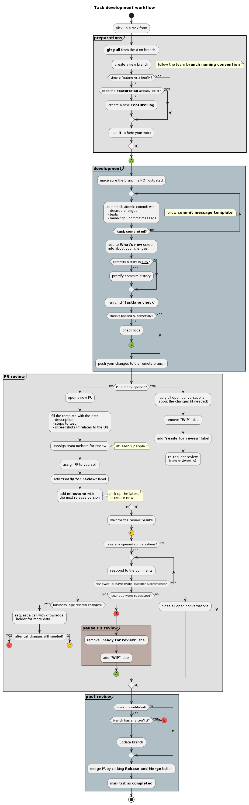

## Task development workflow

This doc contains main moments of the workflow we follow during development a task.

Some references from this doc:

1. [Branch naming convention](./GITHUB_CONVENTIONS.md#branch-naming-rules)
1. [Commit message template](./GITHUB_CONVENTIONS.md#commit-messages)

## Diagram

    
plantuml diagram script

    @startuml
    title: Task development workflow
    start
    :pick up a task from;

    partition #e0e0e0 "**preparations**" {
      :**git pull** from the **dev** branch ;
      :create a new branch;
        floating note right: follow the team **branch naming convention**
      if (simple feature or a bugfix?) then (no)
        if (does the **FeatureFlag** already exist?) then (no)
          :create a new **FeatureFlag**;
        else (yes)
        endif
        :use **it** to //hide// your work;
      else (yes) 
      endif
    }
    
    #8BC34A:(A)
    
    partition #b0bec5 "**development**" {
      :make sure the branch is NOT outdated;
      repeat
        :add small, atomic commit with
         - desired changes
         - tests
         - meaningful commit message;
          floating note right: follow **commit message template**
      repeat while (<b> task completed?) is (no)
      :add to **What's new** screen\ninfo about your changes;
      if (commits history is __dirty__?) then (yes)
        :prettify commits history;
      else (no)
      endif
      : run cmd **`fastlane check`**;
      if (checks passed successfylly?) then (no)
        :check logs;
        #8BC34A:(A)
        detach
      else (yes)
      endif
      :push your changes to the remote branch;
    }
    
    partition #e0e0e0 "**PR review**" {
      if (PR already opened?) then (no)
        :open a new PR;
        :fill the template with the data
         - description
         - steps to test
         - screenshots (if relates to the UI);
        :asssign team mebers for review;
          note right: at least 2 people
        :assign PR to yourself;
        :add **"ready for review"** label;
        :add **milestone** with\nthe next release version;
          note right: pick up the latest\nor create new
      else (yes)
        :notify all open conversations 
         about the changes (if needed);
        :remove **"WIP"** label;
        :add **"ready for review"** label;
        :re-request review 
         from reviwer(-s);
      endif
    
      :wait for the review results;
    
      #ffca28:(C)
    
      if (have any opened conversations?) then (yes)
        repeat
          :respond to the comments;
        repeat while (reviewer(-s) have more questions/comments?) is (yes)
        if (changes were requested?) then (yes)
          if (business-logic-related changes?) then (yes)
            :request a call with knowladge 
             holder for more data;
            if (after call changes still needed?) then (yes)
              #FF5252:(B)
              detach
            else (no)
              #ffca28:(C)
              detach
            endif
          else (no)
            #FF5252:(B)
            partition #bcaaa4 "**pause PR review**" {
              :remove **"ready for review"** label;
              :add **"WIP"** label;
            }
            #8BC34A:(A)
            detach
          endif
        else (no)
          :close all open conversations;
        endif
      else (no)
      endif
    }
    
    partition #b0bec5 "**post review**" {
      if (branch is outdated?) then (yes)
        if (branch has any conflict?) then (yes)
          #FF5252:(B)
          detach
        else (no)
        endif
        :update branch;
      else (no)
      endif
      :merge PR by clicking **Rebase and Merge** button;
      :mark task as **completed**;
    }
    
    stop
    @enduml

--------

[Need to edit diagram?](edit_plantuml_diagrams.md)